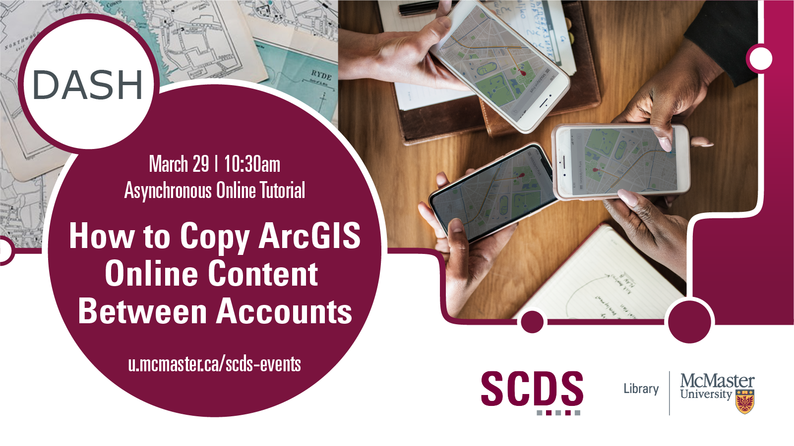

# How to Copy ArcGIS Online Content Between Accounts
 

## Introduction 
Current students, staff, and faculty have access to ArcGIS Online through an Educational Institution Agreement. Content created in the ArcGIS web applications will remain online following graduation but won’t be maintained or updated and are subject to availability of the application. 

Did you know you can copy some content from your McMaster ArcGIS Online account to a personal account? This asynchronous online tutorial will provide you with resources and tools to copy content between accounts. 

Online module created by Christine Homuth, Spatial Information (GIS) Specialist. 

For more information [contact Christine](mailto:libgis@mcmaster.ca) or [schedule a consultation](https://libcal.mcmaster.ca/appointments/gis). 

## Migrating Content 
The workshop outlines two of the methods available that can be used to copy your content between ArcGIS accounts. 

This content has been adapted from the following [Esri Canada Getting Technical](https://resources.esri.ca/getting-technical) articles:

- [Migrating your content between ArcGIS Online, ArcGIS Enterprise or both – Part 1](https://resources.esri.ca/getting-technical/migrating-your-content-between-arcgis-online-arcgis-enterprise-or-both-part-1) 
- [Migrating your content between ArcGIS Online or ArcGIS Enterprise deployments – Part 2](https://resources.esri.ca/getting-technical/migrate-your-content-between-arcgis-online-or-arcgis-enterprise-deployments-or-both-part-2) 

## Getting Started
A sample web map, available at the link below, has been created for the purpose of this workshop. This map highlights one of the new datasets available through the Open Hamilton website, Zoning By-law Boundaries.

- [Hamilton Zoning Map](https://arcg.is/0LP9WP0)
- [Zoning By-law Boundary](https://open.hamilton.ca/datasets/74f8df9efea14e3ba488f98dec289a0c_18/about), Open Hamilton

To get started:
1. Click on the link above for the Hamilton Zoning Map.
2. Choose to *Sign In* with your ArcGIS account.
3. Choose *Save As* to save a copy of the map to your account. 
