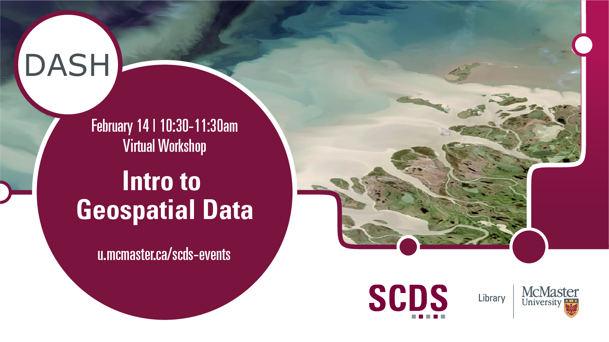

## Introduction to Geospatial Data

Geospatial data is data about objects or features on or near the surface of the Earth and can be mapped using Geographic Information Systems (GIS) software. This workshop introduces participants to geospatial data formats and concepts as well as sources for this data. 

Presentation by Christine Homuth, Spatial Information (GIS) Specialist.
[Get in touch with Christine.](https://library.mcmaster.ca/homuth-christine)

# Workshop Slides

<iframe src="//docs.google.com/viewer?url=https://github.com/scds/dash-webinars/raw/main/assets/docs/Intro_Geospatial_Data_Slides.pdf?dl=0&hl=en_US&embedded=true" class="gde-frame" style="position:absolute;top:0;left:0;width:100%;height:100%;border:none;" scrolling="no"></iframe>

[Download as a PDF](https://github.com/scds/dash-webinars/blob/main/assets/docs/Intro_Geospatial_Data_Slides.pdf)
 
