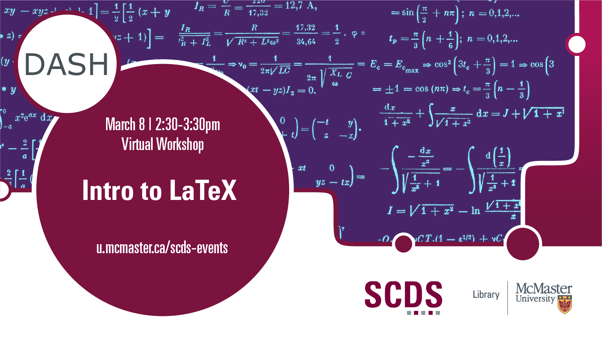

---
---
layout: default
title: Intro to LaTeX
nav_order: 7.5
---

# Intro to LaTeX

This workshop will give you a grounding in LaTeX, a document typesetting program. Widely used in STEM disciplines for its facility in typsetting formulas and equations, LaTeX produces beautiful and usable output. You’ll learn the difference between word processors and typesetters, how to produce those formulae and equations, and the many kinds of documents the LaTeX system can produce. This session will be recorded and made available openly.

**The materials for this workshop are available here:** <https://scds.github.io/intro-latex/>
