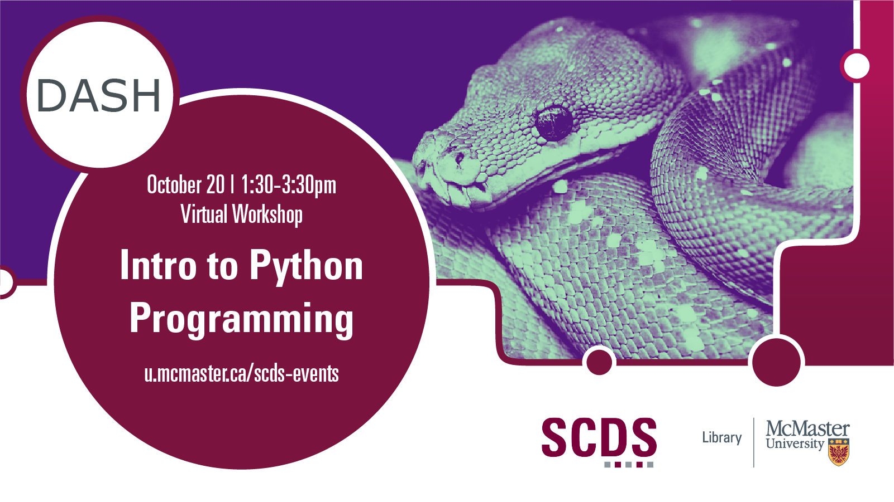

## Introduction to Python Programming

This beginner level workshop will introduce you to the basic concepts of the world's most popular Python programming language. You'll learn to store data in Python data types and variables, as well as learn how to perform operations on numbers and strings. Python IDE Anaconda will be briefly discussed. No prior knowledge of Python is required.

Presentation by Vivek Jadon, Data Specialist.
[Get in touch with Vivek.](https://library.mcmaster.ca/index.php/jadon-vivek)

# Workshop preparation 

Preparation for this tutorial consists of one step: [Getting the software](#get-the-software). Follow the step below. 

## Get the software
This hands-on workshop uses [**Python**](https://www.python.org/downloads/), a software application for data analysis. The program is free to download.
The workshop also uses Jupyter Notebooks via [**Anaconda**](https://www.anaconda.com/). These programs are also free to download.

## Workshop Recording

<iframe height="480" width="853" allowfullscreen frameborder=0 src="https://echo360.ca/media/60aeca91-1d04-493f-a94e-ee733efa3520/public"></iframe>

View the original [here](https://echo360.ca/media/60aeca91-1d04-493f-a94e-ee733efa3520/public). 

## Workshop Slides

<iframe src="//docs.google.com/viewer?url=https://github.com/scds/dash-webinars/raw/main/assets/docs/IntroPythonSlides.pdf?dl=0&hl=en_US&embedded=true" class="gde-frame" style="position:absolute;top:0;left:0;width:100%;height:100%;border:none;" scrolling="no"></iframe>

[Download as a PDF](https://mcmasteru365-my.sharepoint.com/:f:/g/personal/littvs_mcmaster_ca/EgdEyS-gdRpGsDgkTxUzCJ0BfLS5GDR1VruJRZ6ITIqafg?e=GBnvA3)
 
