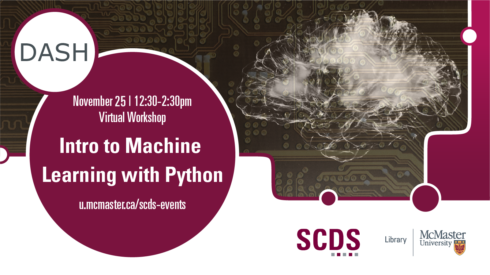

# Machine Learning with Python

Machine Learning is an exciting way to get more insight out of your data. Working with Python, this workshop will cover some basic theory and algorithms for feature learning, classification, and regression. 

Presentation by Isaac Kinley, DASH Support Assistant and PhD Candidate in Psychology, Neuroscience, and Behaviour.
[Book an appointment with Isaac or another member of the DASH Team.](https://library.mcmaster.ca/services/dash)

## Workshop preparation 

Preparation for this tutorial consists of two steps: [Getting the data](#get-the-data) and [Getting the software](#get-the-software). Follow the steps below. 
  
### Get the data
Access the workshop file in [Notebook form](https://colab.research.google.com/drive/1Bn9RlzIizqAuGKI5oZxjjNSWce-Z_Ujj?usp=sharing) or in [.py and .pynb extensions](https://mcmasteru365-my.sharepoint.com/:f:/g/personal/littvs_mcmaster_ca/ErRDPuXg88NMteEABkzQbHABH7vW3s0M_P2zRlF4bfIndg?e=6vZFDd)

### Get the software
This hands-on workshop uses [**Python**](https://www.python.org/downloads/), a software application for data analysis. The program is free to download.

## Workshop Recording

<iframe height="416" width="100%" allowfullscreen frameborder=0 src="https://echo360.ca/media/dd02dd21-aa07-407b-8cdd-f2af0a445e0d/public"></iframe>

View the original [here](https://echo360.ca/media/dd02dd21-aa07-407b-8cdd-f2af0a445e0d/public). 
