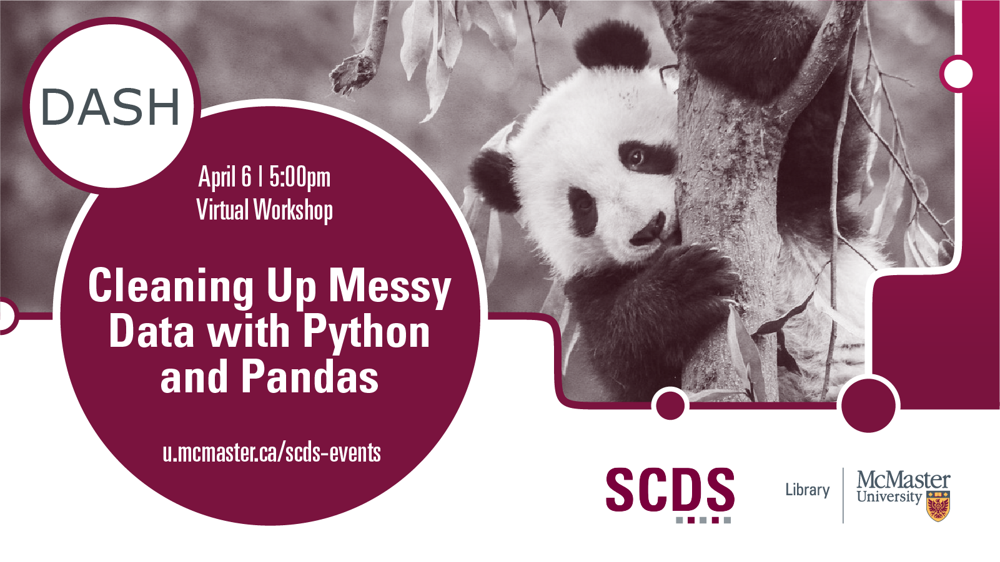

# Cleaning Up Messy Data with Python and Pandas

Raw data often require special preparation for efficient statistical analyses and visualization. This workshop will introduce useful Python functionality along with the pandas package to help organize your raw data and create a clean dataset. Participants will learn how to read multiple CSV files, filter and manipulate their data, and then combine them into a single dataframe according to best practices. 

Presentation by Maya Flannery (DASH Support Assistant). Please note that a beginner-level understand of Python is required for this workshop. 

[Book an appointment with Maya or another member of the DASH Team.](https://library.mcmaster.ca/services/dash)

## Workshop Preparation 

Preparation for this tutorial consists of two steps: [Getting the software](#get-the-software) and [getting the data](#get-the-data). Follow the steps below. 

### Get the software
This hands-on workshop uses [**Python**](https://www.python.org/downloads/), a software application for data analysis. The program is free to download.
The workshop also uses Jupyter Notebooks via [**Anaconda**](https://www.anaconda.com/). These programs are also free to download.

### Get the data
Access the [**experiment files**](https://mcmasteru365-my.sharepoint.com/:u:/g/personal/littvs_mcmaster_ca/EbEdBfmCfmJKi-K1iHFm0kUBPR8Te_5yeQ7czQWq2XxHlA?e=2FuXDc) used in this workshop. Access the [**Jupyter Notebook**](https://raw.githubusercontent.com/scds/dash-webinars/main/workshop-pandas.ipynb) used in this workshop.

## Workshop Recording

<iframe height="416" width="100%" allowfullscreen frameborder=0 src="https://echo360.ca/media/a6890e05-3c38-4371-aafa-5b8328699704/public"></iframe>

[View the original here.](https://echo360.ca/media/a6890e05-3c38-4371-aafa-5b8328699704/public)

## Links and Resources

- [Intro to Pandas](https://pandas.pydata.org/pandas-docs/stable/getting_started/index.html#intro-to-pandas) 
