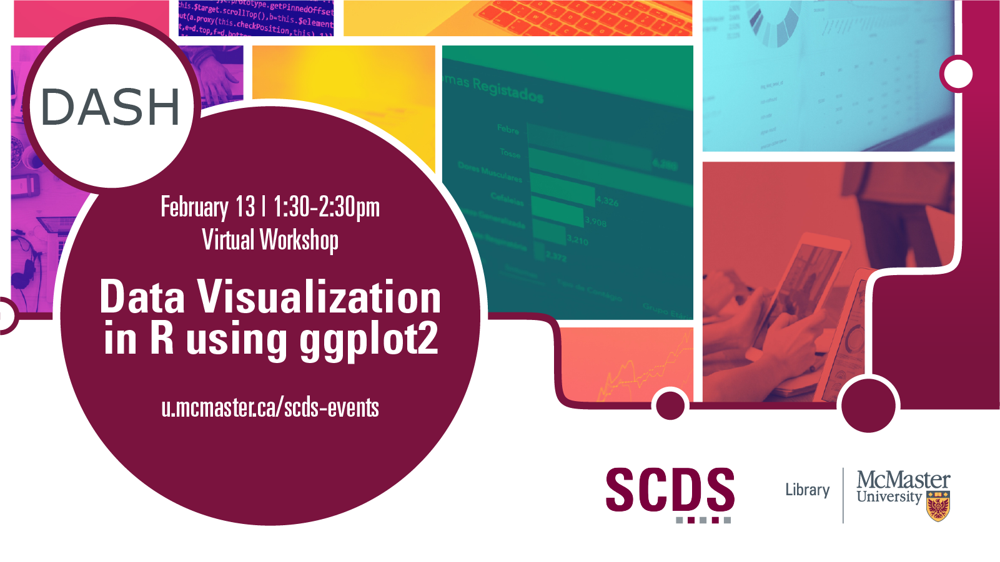

## Data Visualization in R using ggplot2

This virtual workshop provide an introduction to ggplot2, an open-source data visualization package for the statistical programming language R. This workshop will go overbasic tips for creating visualizations and customizing the design of those graphs. A basic familiarity with R will be helpful for this workshop.

Presentation by Subhanya Sivajothy (Data Analysis and Visualization Librarian).

[Book an appointment with Subhanya or another member of the DASH Team.](https://library.mcmaster.ca/services/dash)

# Workshop preparation 

Preparation for this tutorial consists of one step: [Getting the software](#get-the-software). Follow the steps below. 

## Get the software
This hands-on workshop uses [**R**](https://posit.co/download/rstudio-desktop/).

## Asynchronous Video Module

<iframe height="480" width="853" allowfullscreen frameborder=0 src="https://echo360.ca/media/755f87f0-4515-416d-b32f-608a17ec8f26/public"></iframe>

View the original [here](https://echo360.ca/media/755f87f0-4515-416d-b32f-608a17ec8f26/public). 

## Additional Resources

[ggplot2 Cheat Sheet](https://github.com/rstudio/cheatsheets/blob/main/data-visualization.pdf) | 

[Information on Colour](http://sape.inf.usi.ch/quick-reference/ggplot2/colour) | 

[Data Visualization Guide](https://datavizcatalogue.com/) | 
