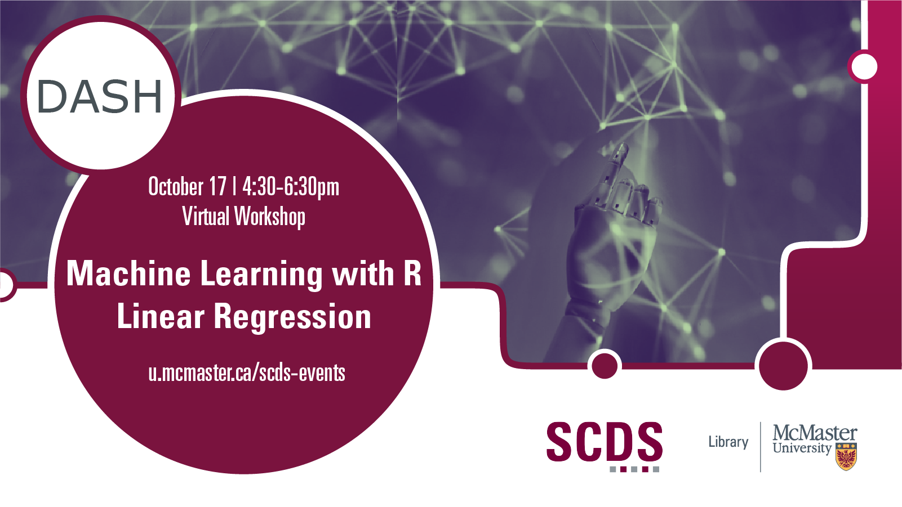

# Machine Learning with R: Linear Regression

This workshop will cover an introduction to linear regression with single and multiple predictor variables, followed by hands-on training on conducting linear regression in R, model training, testing accuracy, and how to interpret and visualize results.

Presentation by Shaila Jamal, DASH Support Assistant and PhD Candidate in Earth, Environment, and Society.
[Book an appointment with Shaila or another member of the DASH Team.](https://library.mcmaster.ca/services/dash)

This event is run in collaboration with the YWCA's Uplift Program, which supports women and non-binary people re-skilling to enter the tech industry. 

## Workshop preparation 

Preparation for this tutorial consists of two steps: [Getting the data](#get-the-data) and [Getting the software](#get-the-software). Follow the steps below. 
  
### Get the data

[Access all the files mentioned in the workshop.](https://mcmasteru365-my.sharepoint.com/:f:/g/personal/littvs_mcmaster_ca/EkUm2pZxDgpNs6-QOG_M5ZUBuIFCHlOM0DEQyTuwqu0wRg?e=Ghg5bD)

### Get the software
This hands-on workshop uses [**R**](https://www.r-project.org/), a software application for data analysis. The program is free to download.

## Workshop Recording

<iframe height="416" width="100%" allowfullscreen frameborder=0 src="https://echo360.ca/media/89dd7672-a26e-49df-93b7-b0d3c6249116/public"></iframe>

[View the original here.](https://echo360.ca/media/89dd7672-a26e-49df-93b7-b0d3c6249116/public)

## Workshop Slides

<embed src="assets/docs/LRSlides.pdf" style="border:none;" width="100%" height="466px">

[Download as PDF.](assets/docs/LRSlides.pdf)
