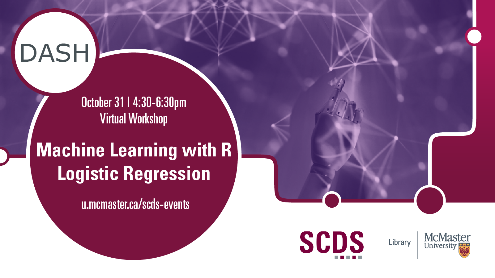

# Machine Learning with R: Logistic Regression

Logistic regression in R programming is a classification algorithm used to find the probably of event success and event failure. This workshop will cover an introduction to logistic regression, followed by hands-on training in how to conduct a logistic regression in R, model training, testing accuracy, and how to interpret and visualize results.

Presentation by Shaila Jamal, DASH Support Assistant and PhD Candidate in Earth, Environment, and Society.

This event is run in collaboration with the YWCA's Uplift Program, which supports women and non-binary people re-skilling to enter the tech industry. 

**The recording and materials for this workshop are available here:** <https://scds.github.io/machine-learning-with-r/logistic-regression.html>

