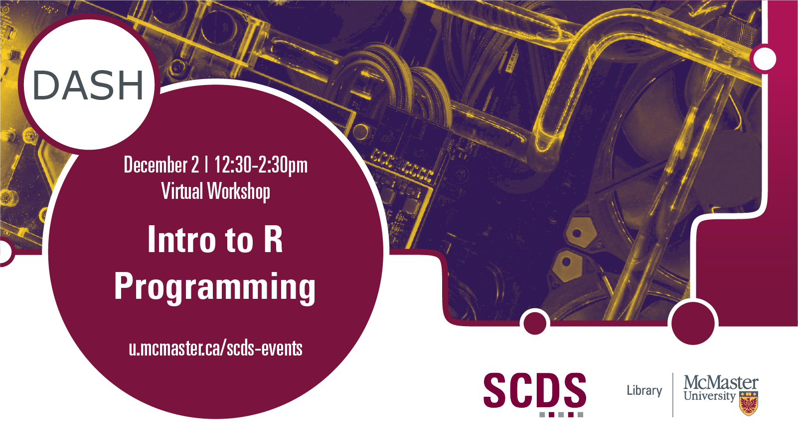

## Introduction to R Programming

R has a powerful suite of high-level statistical functions, but sometimes you need lower-level control over the functionality of your script. In this workshop, you will learn how to write programs in R using functions and control flow. We will cover functions, conditional blocks, loops, and debugging. 

Presentation by Isaac Kinley, DASH Support Assistant and PhD Candidate in Psychology, Neuroscience, and Behaviour.
[Book an appointment with Isaac or another member of the DASH Team.](https://library.mcmaster.ca/services/dash)

# Workshop preparation 

Preparation for this tutorial consists of two steps: [Getting the data](#get-the-data) and [Getting the software](#get-the-software). Follow the steps below. 
  
## Get the data
The data is formatted as R files. Access the workshop files on [GoogleDrive](https://drive.google.com/drive/folders/1HBWFBKHnDBe5S9wSzC4F7DvU-XPCEdQW?usp=sharing) or [SharePoint](https://mcmasteru365-my.sharepoint.com/:f:/g/personal/littvs_mcmaster_ca/ElOm2kP5LhBOo9T8iZefvZkBjUfV2a_rIBjQPgxPdGfe6g?e=LjvJlc) .

## Get the software
This hands-on workshop uses [**R**](https://www.r-project.org/), a software application for data analysis. The program is free to download.

## Workshop Recording

<iframe height="480" width="853" allowfullscreen frameborder=0 src="https://echo360.ca/media/ac3c8750-dd6f-46df-9db7-0a158476f41a/public"></iframe>

View the original [here](https://echo360.ca/media/ac3c8750-dd6f-46df-9db7-0a158476f41a/public). 
