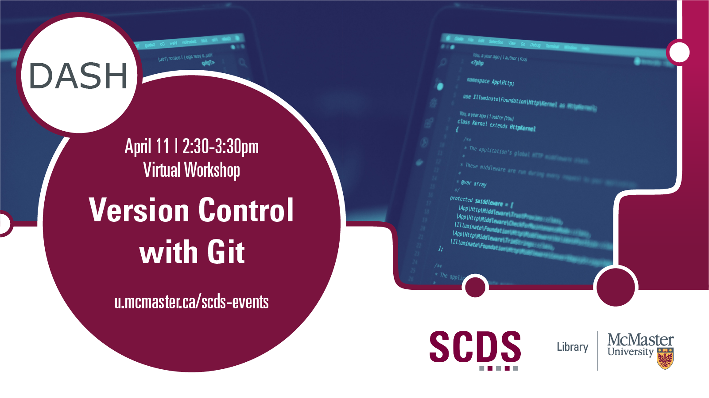

# Version Control with Git

Come learn about git! Git is a version control system widely used in software engineering, academia, and anywhere where projects need reliable and granular versioning -- especially when the projects need to scale to thousands of contributors. You'll learn the basics of working with git repositories, how to pull new repositories from sites like Github, and more.

Presentation by John Fink, Digital Scholarship Librarian.
[Book an appointment with John or another member of the SCDS Team.](https://libcal.mcmaster.ca/appointments/)

## Workshop Preparation 

Preparation for this tutorial consists of one step: [Getting the software](#get-the-software). Follow the step below. 

### Get the software
This hands-on workshop uses [**Git**](https://git-scm.com/downloads), a free program that allows version control. 

## Workshop Recording

<iframe height="416" width="100%" allowfullscreen frameborder=0 src="https://echo360.ca/media/920779d4-4319-49f1-9b3a-d5c9ebb33723/public"></iframe>

[View the original here.](https://echo360.ca/media/920779d4-4319-49f1-9b3a-d5c9ebb33723/public)
