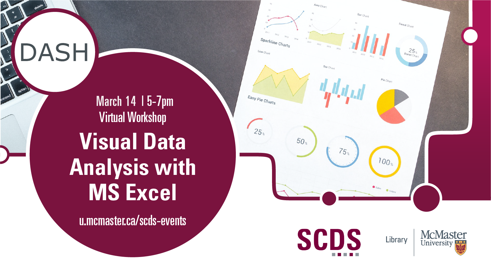

## Visual Data Analysis with Microsoft Excel

Data visualization is the graphical representation of information and data. This workshop will cover topics such as applications of data analysis basics for visualizations; effective designs of basic charts such as pie charts, bar charts, and scatterplots; time series analysis and visualization; and more advanced analytical displays like bar-in-bar, slope charts, dot plots, and bullet charts. 

A basic working knowledge of MS Excel is required for this workshop. 

Presentation by Shaila Jamal, DASH Support Assistant and PhD Candidate in Earth, Environment, and Society.
[Book an appointment with Shaila or another member of the DASH Team.](https://library.mcmaster.ca/services/dash)

# Workshop preparation 

Preparation for this tutorial consists of two steps: [Getting the data](#get-the-data) and [Getting the software](#get-the-software). Follow the steps below. 
  
## Get the data

[Access the files mentioned in the workshop.](https://mcmasteru365-my.sharepoint.com/:f:/g/personal/littvs_mcmaster_ca/EvEe64azH5dPvcGVazH-VSIBxllXvnHPp3ELy6knsHTZlQ?e=3OmIaU)

## Get the software
This hands-on workshop uses [**Excel**](https://www.microsoft.com/en-us/microsoft-365/free-office-online-for-the-web), a software application for data analysis. The program is included with McMaster tuition and a free version is linked in the previous sentence.

## Workshop Recording

<iframe height="480" width="853" allowfullscreen frameborder=0 src="https://echo360.ca/media/66d0e84b-3056-4a9c-ad6f-3a98ef784979/public"></iframe>

View the original [here](https://echo360.ca/media/66d0e84b-3056-4a9c-ad6f-3a98ef784979/public). 

## Workshop Slides

<iframe src="//docs.google.com/viewer?url=https://github.com/scds/dash-webinars/raw/main/assets/docs/VDASlides.pdf?dl=0&hl=en_US&embedded=true" class="gde-frame" style="position:absolute;top:0;left:0;width:100%;height:100%;border:none;" scrolling="no"></iframe>

[Download as a PDF](https://mcmasteru365-my.sharepoint.com/:f:/g/personal/littvs_mcmaster_ca/EvEe64azH5dPvcGVazH-VSIBxllXvnHPp3ELy6knsHTZlQ?e=3OmIaU)
 

